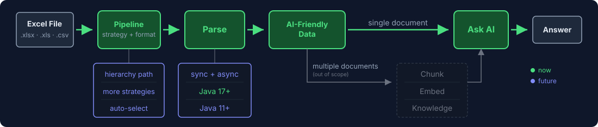
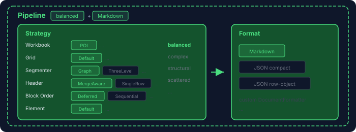

  

# read4ai-excel

> **A predictable, maintainable, and transparent Excel parser.** — [Try the demo](https://huggingface.co/spaces/read4ai/read4ai)  
> **An intelligent pipeline that selects the optimal parsing strategy and AI-friendly format for your file.**

  

- [Getting Started](docs/guide.md)
- [Benchmark](docs/benchmark/)
- [Full Roadmap](docs/roadmap.md)

## The problem with Excel

Spreadsheets mix data with layout. No semantic markup to guide a parser:

- Merged cells, multi-level headers, side-by-side tables, scattered text blocks
- Existing tools extract flat cell grids — fine for humans, but they lose the structure LLMs need
- Raw XLSX wastes tokens, hits context limits, and forces the model to guess

## Philosophy

### 1. Designed to be verified, not just claimed

| 2026-04-18        | read4ai-excel v0.1.0 | pandas 3.0 | SheetJS 0.20 | calamine 0.6 |
|-------------------|----------------------|------------|--------------|--------------|
| GPT-5.4 mini      | 🏆 **88.3%**        | 82.0%      | 84.4%        | 82.8%        |

The verification loop **parse → ask AI → measure → improve** runs on every change.

- Published [golden set](docs/benchmark/) with every evaluation result. [Try it yourself](https://huggingface.co/spaces/read4ai/read4ai)
- A private hidden holdout prevents overfitting
- Every fixture added makes the loop stronger

> Bug reports and fixture submissions directly strengthen the loop. [Submit your golden set](docs/benchmark/README.md)

### 2. Composable pipeline — you steer the strategy

  

**The real goal isn't parsing — it's AI comprehension.** Success is measured by whether an LLM can correctly answer questions about the data.

And Excel doesn't have one right answer. A financial report, a multi-table schedule, and a scattered data export each reward different heuristics. Instead of hiding that, the pipeline is **open at every stage**:

- **6 pluggable interfaces** — `WorkbookReader` · `GridExtractor` · `Segmenter` · `HeaderDetector` · `BlockOrderer` · `ElementClassifier`. Implement one, pass it to `PipelineConfig`, and your strategy is live.
- **Output is an interface too** — `DocumentWriter` with two built-in layouts (compact JSON, markdown). Custom formats plug in the same way.
- **Pre-tested strategies for known shapes** — `Strategy.balanced()` (default), or `complex()` / `structural()` / `scattered()` for multi-level merged headers, sparse data islands, and similar patterns.
- **Safe experiments** — unstable APIs are marked `@ExperimentalRead4ai`; opt-in is explicit.

If the default pipeline misses your use case, don't fork the library. Plug in the piece that fits — or inject a strategy tuned to your spreadsheets' character. [Compose your own](docs/guide.md).

### 3. Designed to be dependable

- **Java 25+** — requires Java 25 or newer; uses virtual threads natively
- **Stable public API** — predictable interfaces that won't break between releases
- **Minimal dependencies** — Kotlin + Apache POI. No frameworks, no magic
- **AI-friendly repository** — all documentation in Markdown, ready for AI-assisted development
