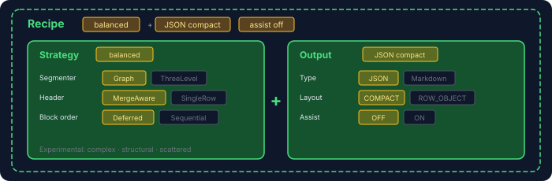

  

# read4ai-excel

> **A structure-preserving Excel parser for merged cells, multi-table sheets, and structured JSON output.** — [Try the demo](https://huggingface.co/spaces/read4ai/read4ai)
> **Built for spreadsheet understanding: predictable parsing, composable recipes, and benchmarked downstream Q&A.**

  

- [Getting Started](docs/guide.md)
- [read4ai-excel vs pandas](docs/read4ai-vs-pandas.md)
- [Benchmark](docs/benchmark/)
- [Full Roadmap](docs/roadmap.md)

`read4ai-excel` is a Kotlin Excel parser for AI and LLM workflows.
It is designed for spreadsheets that behave like documents, not just tables:

- merged cells and merged header bands
- multi-row headers
- side-by-side or stacked tables
- text blocks, notes, and mixed table/text sheets

## Philosophy

### 1. Designed for the missing JVM layer

- Python users often start with `pandas` when a workbook is already a clean table.
- JVM teams have Apache POI and similar workbook APIs for reading and writing Excel files.
- Document-like spreadsheets still require layout recovery, parsing strategy, and model-ready output.

`read4ai-excel` focuses on spreadsheets where:

- merged headers carry meaning
- side-by-side tables need separation
- notes and text blocks affect interpretation
- layout semantics matter

> The goal is not flat extraction alone: parsed output should help downstream question answering use the spreadsheet correctly.

### 2. Designed to be verified, not just claimed

| 2026-04-24        | read4ai-excel v0.3.0 | pandas 3.0 | SheetJS 0.20 | calamine 0.6 |
|-------------------|----------------------|------------|--------------|--------------|
| GPT-5.4 mini      | 🏆 **92.1%**        | 78.3%      | 77.8%        | 73.9%        |

The verification loop **parse → ask AI → measure → improve** runs on every change.
AI is part of the workflow, but the benchmark harness is what makes improvements measurable, repeatable, and falsifiable.

- Published [benchmark reports](docs/benchmark/) with public fixture details and evaluation results. [Try it yourself](https://huggingface.co/spaces/read4ai/read4ai)
- A private hidden holdout prevents overfitting
- Every fixture added makes the loop stronger
- Harness engineering turns parser iteration into something you can verify, not just claim

> Bug reports and fixture submissions directly strengthen the loop. [Submit your golden set](docs/benchmark/README.md)

### 3. Designed to be composable, not prescriptive

  

Excel doesn't have one right answer.
A financial report, a multi-table schedule, and a scattered data export each reward different heuristics.

A recipe combines a parsing strategy with an output setup.
The important strategy axes are swappable, and output stays explicit about type, layout, and assist mode.

- **Pre-built strategies** — `balanced` plus experimental `complex` / `structural` / `scattered`.
- **Experimental options** — marked `@ExperimentalRead4ai`; opt-in is explicit.
- Experimental methods can be applied without rewriting the whole parser, then benchmarked and kept only when they actually help
- The long-term goal is not one rigid parser, but a system that can choose the right recipe for each spreadsheet type

> Custom strategies plug in without forking the library. [Compose your own](docs/guide.md)

### 4. Designed to be dependable

- **Explicit API evolution** — breaking changes are called out in release notes while the library is still in `v0`.
- **Deterministic output** — same file + same strategy → same bytes. No hidden global state, no runtime magic.
- **No framework lock-in** — plain JVM library for Kotlin and Java. No Spring, no DI container, no annotation processors.
- **Readable repo** — Markdown docs and small interfaces make the project easier to inspect, test, and extend.
